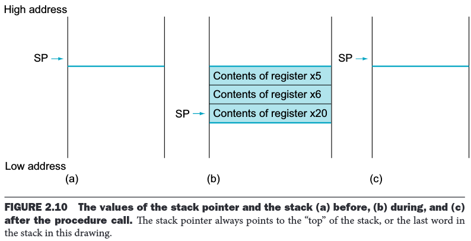

# TDT4160: Praktisk øving 3

> [!NOTE]
> Informasjonen er hentet direkte fra INGInious brukt i kurset.

I denne øvingen skal du skrive RISC-V-assembly. For å kjøre og teste koden bruker vi simulatoren Ripes. Du kan enten laste ned Ripes til din egen maskin, eller bruke online-simulatoren på [ripes.me](https://ripes.me/).

I Ripes velger du CPUen "Single Cycle Processor". Pass også på å huke av for ISA Exts.-valget "M". Se dokumentet på Blackboard dersom du trenger hjelp med Ripes.

## Funksjoner og ABI

I denne øvingen skal du implementere funksjoner, og denne gangen skal vi gjøre det helt etter boka. Dette betyr at funksjonen må tilfredsstille krav til å bevare stakken og visse registre slik de var før funksjonen ble kalt.

Hvilke registre som må bevares er oppgitt i RISC-V ABIen. En ABI er en avtale om hva funksjoner har lov til og ikke lov til å gjøre. Å være enige om en ABI gjør det mulig for funksjoner skrevet av ulike mennesker/kompilatorer å kalle hverandre, uten å overskrive hverandres verdier.

Listen over registre som skal bevares er oppgitt på RISC-V Reference Card, som dere finner på Blackboard og får utdelt på eksamen. Den relevante delen er:


Hvert register har både et hardware-navn, og et ABI-navn. ABI-navnene gir hint om hvordan registrene kan/skal brukes av funksjoner. For eksempel så skal all registre som begynner på `s` bevares.

At et register er bevart betyr ikke at det er forbudt å overskrive det, men du må passe på at registeret får gjenopprettet sin opprinnelige verdi før du returnerer. Dette gjør vi enklest ved å legge den opprinnelige verdien til sides i starten av funksjonen, for så å hente den frem igjen på slutten.

Når vi skal legge verdien til side er det vanlig å bruke stakken. Stakken er et del av minnet som vi kan vokse og krympe som vi vil. Når vi trenger et sted å lagre noen registere er det bare å utvide stakken, og legge verdiene der.

For å utvide stakken flytter vi registret `sp` nedover, siden stakken vokser nedover. Å flytte stakk-pekeren 8 bytes nedover gir oss dermed 8 bytes vi kan bruke som vi vil. Her kan vi legge verdier vi ville bevare.

Vi må **ikke** finne på å skrive til stakken utenfor disse 8 bytesene. Da risikerer vi å overskrive stakk-området til funksjonen som kalte oss, eller få verdiene overskrevet av funksjoner vi selv kaller.

Et eksempel på bruk av stakk er illustrert i Figur 2.10 fra side 107 i boka:



I eksempelet blir de opprinnelige verdiene til x5, x6 og x20 lagret på stakken. Før funksjonen kan returnere må verdiene skrives tilbake til registrene, og stakk-pekeren flyttes tilbake der den var. Stack-pekeren (`sp`) i seg selv er også et bevart register.

Et eksempel på en funksjon som bruker stakken for å bevare verdier er `call_twice`.

```asm
# Kaller funksjonen call_once to ganger, og returnerer summen av returverdiene i a0
call_twice:

    # Setter til sides 8 bytes på stakken
    addi sp, sp, -8
    # Lagrer s0 og ra på stakken
    sw s0, 4(sp)
    sw ra, 0(sp)

    call call_once
    # Lagrer returverdien i s0, slik at den er bevart
    mv s0, a0

    call call_once
    # Regner ut den endelige returverdien
    add a0, a0, s0

    # Før vi kan forlate funksjonen må vi gjenopprette s0 og ra
    lw s0, 4(sp)
    lw ra, 0(sp)
    # Flytter stakk-pekeren tilbake til der den var
    addi sp, sp, 8

    # Forlater call_twice-funksjonen
    ret
```

Funksjonen `call_twice` måtte sette til sides retur-adressen i `ra`, fordi `ra` blir overskrevet hver gang man gjør et `call`. Hvis vi ikke gjenoppretter `ra`-verdien vil `ret`-instruksjonen returnere til feil sted.

I tillegg setter vi til sides verdien som ligger i `s0` når `call_twice` kalles. Dette lar oss trygt overskrive `s0` og bruke den til egne formål. Ved å lagre returverdien fra første kall til `call_once` i `s0`, er vi sikre på at neste kall til `call_once` ikke overskriver den. Til gjengjeld må vi selv gjenopprette den opprinnelige verdien til `s0` fra stakken før vi returnerer.

Helt til slutt flytter til `sp` tilbake opp, slik at stakken ser ut som den gjorde før kallet til `call_twice`.

Øvingen består av 3 oppgaver, og i hver oppgave skal du implementere en funksjon som tilfredsstiller ABIen. Øvingssystemet vil sjekke at ingen av registrene som skal bevares har blitt overskrevet, og at stakken ser ut som den gjorde før funksjonen din ble kalt.

Når du har implementert ferdig en funksjon trykker du "Run". Skjelettene inkluderer noen tester, som printer til konsollen om noe gikk galt. Hvis ikke printes det til konsollen at testen var vellykket.

Når du laster opp løsningene dine vil koden testes på litt andre tester enn de du finner i skjelettet. Dersom koden din produserer feil svar på noen av testene vil du få beskjed om hvordan testen ser ut.

## Oppgave 1: Allokere en sekvens

I denne oppgaven skal du skrive en funksjon allokerer en liste og så fyller listen med tall. Skjelettet til denne oppgaven finner du her: tdt4160-p3-1.S

Kopier KUN teksten innenfor det markerte området der du har skrevet din egen kode.

## Oppgave 2: Fylle liste med tilfeldige tall

I denne oppgaven skal du skrive en funksjon som fyller en liste med tilfeldige tall. Skjelettet til denne oppgaven finner du her: tdt4160-p3-2.S

Kopier KUN teksten innenfor det markerte området der du har skrevet din egen kode.

## Oppgave 3: Sum av binært tre

I denne oppgaven skal du skrive en funksjon som bruker stakken for å traversere et binært tre. Skjelettet til denne oppgaven finner du her: tdt4160-p3-3.S

Kopier KUN teksten innenfor det markerte området der du har skrevet din egen kode.
