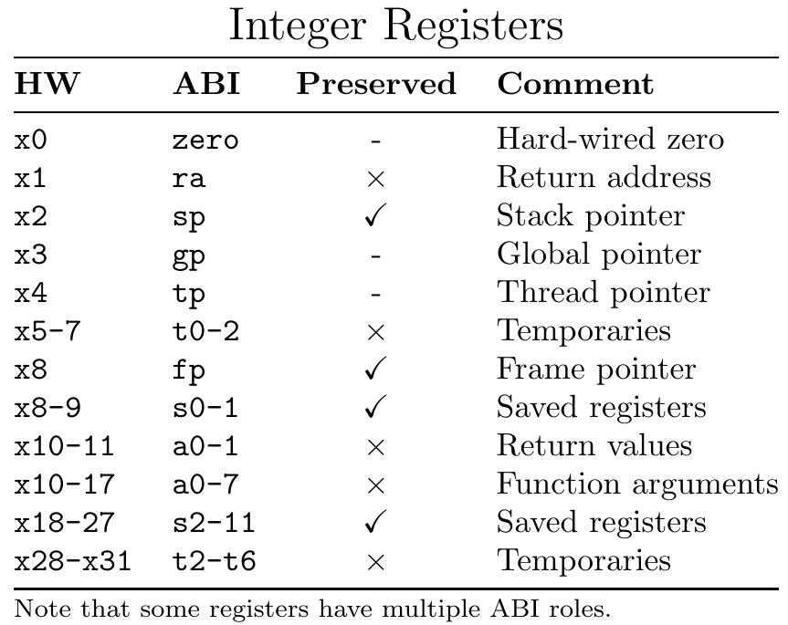
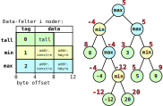

# TDT4160: Praktisk øving 4

> [!NOTE]
> Informasjonen er hentet direkte fra INGInious brukt i kurset.

I denne øvingen skal du skrive RISC-V-assembly. For å kjøre og teste koden bruker vi simulatoren Ripes. Du kan enten laste ned Ripes til din egen maskin, eller bruke online-simulatoren på [ripes.me](https://ripes.me/).

I Ripes velger du CPUen "Single Cycle Processor". Pass også på å huke av for ISA Exts.-valget "M". Se dokumentet på Blackboard dersom du trenger hjelp med Ripes.

## Rekursive funksjoner

I denne øvingen skal du implementere en rekursiv funksjon, altså en funksjon som kaller seg selv. Akkurat som i forrige øving må vi passe på at funksjonen tilfredstiller kravene satt i ABIen, slik at funksjonskallene ikke overskriver hverandres verdier.

Når vi vil beholde en verdi på tvers av et funksjonskall, må vi legge den i et bevart register før vi kaller funksjonen.

Listen over registre som skal bevares er oppgitt på RISC-V Reference Card, som dere finner på Blackboard og får utdelt på eksamen. Den relevante delen er:



Når vi bruker et bevart register, må vi først passe på at den opprinnelige verdien til det bevarte registeret er lagt på stakken. Dette gjør vi gjerne i toppen av funksjonen.

Husk at når vi bruker stakken, må vi først utvide den ved å flytte `sp`-registeret nedover. Deretter kan vi lagre verdiene vi vil bevare på stakken, med `sw`-instruksjonen.

Når vi til slutt skal returnere fra funksjonen bruker vi `lw`-instruksjonen for å lese inn de bevarte verdiene. Til sist flytter vi `sp` tilbake slik at stakken igjen ser ut som den gjorde da funksjonen ble kalt.

Et bilde som illusterer bruk av stakk er Figur 2.10 fra side 107 i boka:


For et eksempel på en funksjon som bruker stakken gjengir vi `call_twice`-funksjonen fra forrige øving:

```asm
# Kaller funksjonen call_once to ganger, og returnerer summen av returverdiene i a0
call_twice:

    # Setter til sides 8 bytes på stakken
    addi sp, sp, -8
    # Lagrer s0 og ra på stakken
    sw s0, 4(sp)
    sw ra, 0(sp)

    call call_once
    # Lagrer returverdien i s0, slik at den er bevart
    mv s0, a0

    call call_once
    # Regner ut den endelige returverdien
    add a0, a0, s0

    # Før vi kan forlate funksjonen må vi gjenopprette s0 og ra
    lw s0, 4(sp)
    lw ra, 0(sp)
    # Flytter stakk-pekeren tilbake til der den var
    addi sp, sp, 8

    # Forlater call_twice-funksjonen
    ret
```

Denne siste øvingen består av kun 1 oppgave, og som vanlig får du utdelt et skjelett med noen tester.

Når du laster opp løsningen din vil koden testes på litt andre tester enn de du finner i skjelettet. Dersom koden din produserer feil svar på noen av testene vil du få beskjed om hvordan testen ser ut.

---

I denne oppgaven skal du skrive en rekursiv funksjon som traverserer et min-max-tre.

Treet består av 3 typer noder: tall, min, max. De første 4 bytesene i noden bestemmer typen.

- `0` = tall-node.
- `1` = min-node.
- `2` = max-node.

Deretter følger nodens data. Dataen avhenger av typen node:

- tall-noder har ett 32-bits tall, som er tallverdien til noden.
- min og max-noder har to 32-bits adresser, til nodene som er venstre og høyre barn i treet.

Funksjonen din skal evaluere en gitt node, og returnere et 32-bits tall. Dette gjøres etter følgende regler:

- tall-noder evaluerer til tallet de inneholder.
- min-noder evalueres ved å evaluere venstre og høyre barn, og deretter velge det minste tallet.
- max-noder evalueres likt som min-noder, men velger det største tallet i stedet.

Et eksempel på et min-max-tre er illustrert under. Verdien man skal få når man evaluerer noden er skrevet i rødt.



Skjelettet til denne oppgaven finner du her: tdt4160-p4-1.S. Testen i skjelettet er treet vist i bildet.

Kopier KUN teksten innenfor det markerte området når du leverer.
